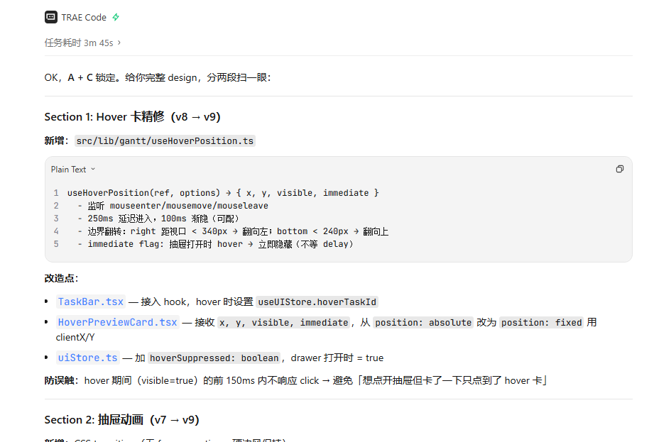
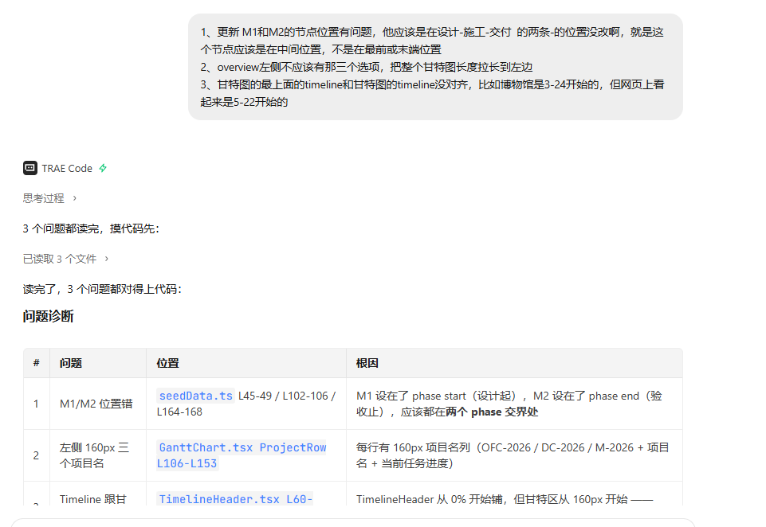
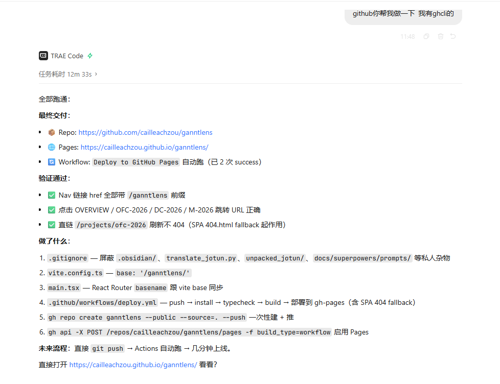

# GanttLens —— 一个非程序员做的施工项目甘特图

> **作者**：Cailleach（邹景焘）· 弱电智能化设计师
> **工具**：TRAE IDE
> **Demo**：[cailleachzou.github.io/ganntlens](https://cailleachzou.github.io/ganntlens/)
> **代码**：[github.com/cailleachzou/ganntlens](https://github.com/cailleachzou/ganntlens)
> **Session ID**：
> - `3928979018359690:a0f4ae9c578a4ac38a8e8e2942754e46_6a3107250aa837c4de6b74d2.6a310e930aa837c4de6b76c6.6a310e930aa837c4de6b76c4:TRAE Work CN.0.1.19.no_sid.no_ppe.T(2026/6/16 16:51:31)`（D1-D2 大甘特图 + 共享时间轴）
> - `3928979018359690:2ee16ab9c6bd4a0910b728955f9cbd99_6a3107250aa837c4de6b74d2.6a3109d70aa837c4de6b7594.6a3109d70aa837c4de6b7592:TRAE Work CN.0.1.19.no_sid.no_ppe.T(2026/6/16 16:31:19)`（D3 节点下钻 4-Tab 抽屉）
> - `3928979018359690:e8b463a795a9180b4981ce865712aa43_6a325035244476575c84e522.6a3253ec244476575c84e58c.6a3253ec244476575c84e58a:TRAE Work CN.0.1.19.no_sid.no_ppe.T(2026/6/17 15:59:40)`（D4 Hover v9 + 抽屉 v9）
> - `3928979018359690:378a67725405ff904ec0b6d025773104_6a325035244476575c84e522.6a335f4fbdc087dbd2f48ccf.6a335f4fbdc087dbd2f48ccd:TRAE Work CN.0.1.19.no_sid.no_ppe.T(2026/6/18 11:00:31)`（D4 chips 推翻 + M1/M2 阶段边界）
> - `3928979018359690:56d6f6b2026b5b40518bc72ea5a7fc7b_6a325035244476575c84e522.6a336a77bdc087dbd2f48ec0.6a336a77bdc087dbd2f48ebe:TRAE Work CN.0.1.19.no_sid.no_ppe.T(2026/6/18 11:48:07)`（D4 GitHub Pages 部署）

---

## 开发过程截图

### Hover 预览卡 v9

D4 翻车重做：250ms 进入延迟 + 靠右翻转 + 抽屉打开时立即隐藏。

### M1/M2 节点位置修复

里程碑应在阶段交界处（设计→施工 / 施工→验收），不是项目起讫。

### GitHub Pages 部署

踩了 5 个坑（vite base / Router basename / SPA 404 fallback / vite/client 类型 / workflow 启用），最终 push 即自动部署。

---

**作者**：Cailleach（邹景焘）· 弱电智能化设计师
**工具**：TRAE IDE
**链接**：[Demo](https://cailleachzou.github.io/ganntlens/) · [代码](https://github.com/cailleachzou/ganntlens) · [入围链接](https://forum.trae.cn/t/topic/23972)
