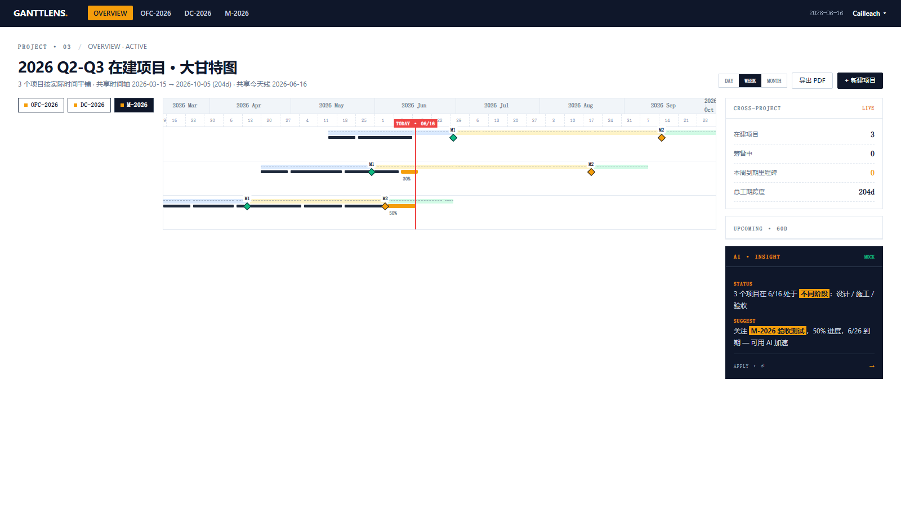

# GanttLens

> 一个非程序员做的施工项目甘特图 —— Vibe Coding 4 天从 0 到 GitHub Pages


**GanttLens** 是面向弱电智能化施工项目的"节点下钻式"甘特图管理工具。把 Excel、PPT、NAS、微信群里散落的信息收进一张大甘特图 + 4-Tab 抽屉，一个屏幕里完成"看进度 → 看细节 → 拿文件 → 问 AI"。

[在线 Demo](https://cailleachzou.github.io/ganntlens/) · [参赛稿](https://github.com/cailleachzou/ganntlens/blob/main/GanttLens-Demo-Post.md) · [TRAE AI 创造力大赛](https://forum.trae.cn/t/topic/23972)

---

## 一图速览

| | | |
|---|---|---|
|  |  |  |
| **主界面** · 共享时间轴 + 三色阶段带 | **节点下钻** · 4-Tab 抽屉 | **Hover 预览** · v9 防误触 |
|  |  |  |
| **Chips 移顶部** · 全宽 1560px | **M1/M2 阶段交界** · 业务人 3 秒推翻 | **部署成功** · GitHub Actions |

---

## 核心特性

- **共享时间轴大甘特图** — 3 个项目按实际时间平铺，共享月/周刻度、共享"今天线"
- **三色阶段带** — 设计（蓝）/ 施工（黄）/ 验收（绿）背景色 + 红色 today line
- **里程碑菱形 ◆** — M1（设计→施工）、M2（施工→验收）标记在阶段交界处
- **节点下钻 4-Tab 抽屉** — 点任务/里程碑 → 右滑抽屉：详情 / 文件 / 活动 / AI 建议
- **Hover 预览卡 v9** — 250ms 延迟防误触、靠右自动翻转、点任务后立即消失
- **AI Chat + 命令路由** — `/move M1 +7d`、`/risk overview` 自然语言命令
- **计划/实际双轨** — 任务条支持 `actualStart/actualEnd` 同屏对比
- **可访问 GitHub Pages** — push → Actions → 自动部署

---

## 我为什么做这个

我做弱电智能化设计十来年，一个项目 3-6 个月、手上同时跑 5-10 个。最烦的不是"画甘特图"，是"想看进度"得开 5 个文档：Excel 看计划、NAS 看文件、文件柜看里程碑依据、微信群看客户更新、AI 建议在脑子里。

我用 Vibe Coding 做了 GanttLens——**我不写代码，但能定义"翻车了"**。这篇 README 也是这个过程的产物：业务人提需求、AI 写、我提"这不对、那不行"。

---

## 快速开始

```bash
git clone https://github.com/cailleachzou/ganntlens.git
npm install
npm run dev          # http://localhost:5173
npm run build        # 输出到 dist/
npm run typecheck    # TypeScript 检查
```

技术栈：**React 18 + TypeScript + Vite 5 + Zustand 4 + Tailwind CSS 3 + frappe-gantt**

---

## 4 天开发过程

| Day | 主题 | 关键产出 |
|---|---|---|
| 1-2 | 大甘特图 + 共享时间轴 | Vite 脚手架、3 个脱敏项目、共享时间轴 |
| 3 | 节点下钻 4-Tab 抽屉 | 详情 / 文件 / 活动 / AI 建议 4 个 Tab |
| 4 | Hover v9 + chips 布局推翻 + GitHub Pages | hover v9 重做、chips 移到顶部、5 个部署坑 |

完整开发过程见 [`GanttLens-Demo-Post.md`](https://github.com/cailleachzou/ganntlens/blob/main/GanttLens-Demo-Post.md)。

---

## 我作为非程序员的反思

Vibe Coding 的核心收益不是"AI 干得快"，是"推翻 AI 干得动"。

我敢说"这版不行、重做"的前提，是重写成本几乎为零——上面 6 张截图背后，至少有 3 张是"推翻再重做"后留的：

- **`03-hover-v9.png`**：v8 翻车（防误触 / 边界 / 生命周期三个 bug）后 v9 重做，7/7 验证通过
- **`04-chips-top.png`**：推翻三栏布局，把甘特图从 1303px 拉到 1560px，时间轴终于对齐
- **`05-m1m2-phase-boundary.png`**：推翻 M1/M2 节点位置，从"项目起讫"改到"阶段交界"

**非程序员的核心能力不是写代码，是定义"翻车了"。**

---

## 路线图

- [ ] **D6**：Gantt 拖拽编辑（鼠标拖任务条改 `planEnd`）
- [ ] **D7**：多用户协作（Yjs / Liveblocks 实时同步）
- [ ] 真实 LLM 接入（OpenAI / Anthropic，API key 自填）
- [ ] 导入 MS Project / Excel
- [ ] 甘特图 ↔ 看板视图切换

---

## 致谢

感谢 **TRAE AI 创造力大赛** 给我这次机会——没有这个契机，我大概率还是会在 Excel 和 PPT 之间来回切。

工具方面感谢 **TRAE IDE**，陪我走完 4 天从脚手架到 GitHub Pages 部署的全过程。

---

## 作者

**Cailleach（邹景焘）** · 弱电智能化设计师 / 项目提案工程师

- 邮箱：（待补充）
- GitHub：[@cailleachzou](https://github.com/cailleachzou)

---

## Contributors

- **Cailleach（邹景焘）** — 业务需求、方案设计、验收
- **TRAE IDE** — AI 编程搭档，全程 Vibe Coding

---

> *本项目由 Vibe Coding 驱动：业务人提需求，AI 写代码，业务人验收。*
