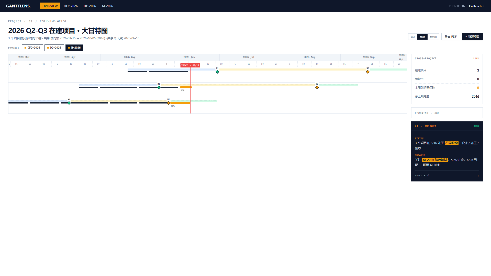
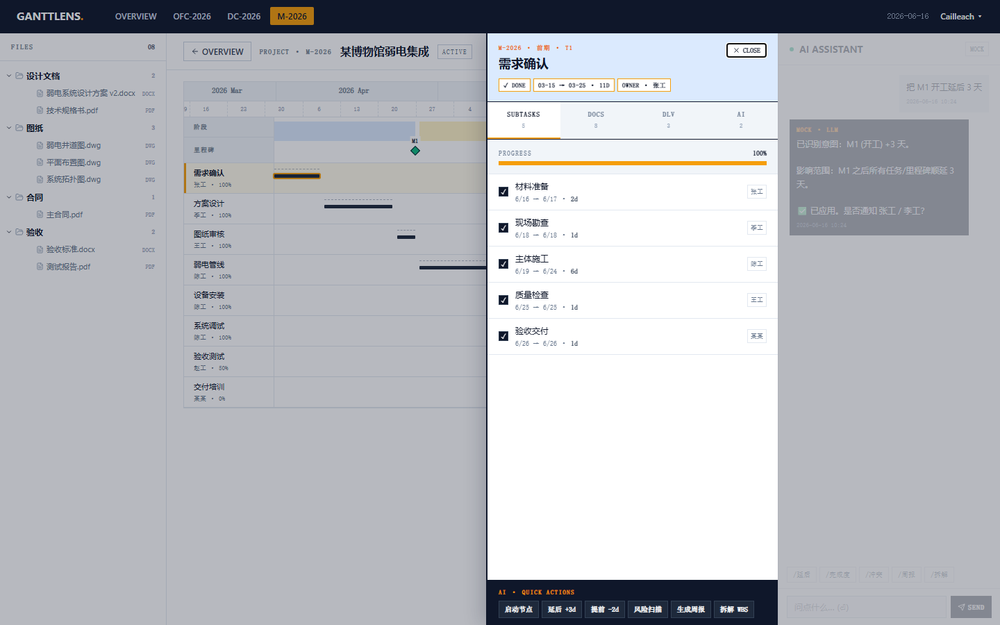
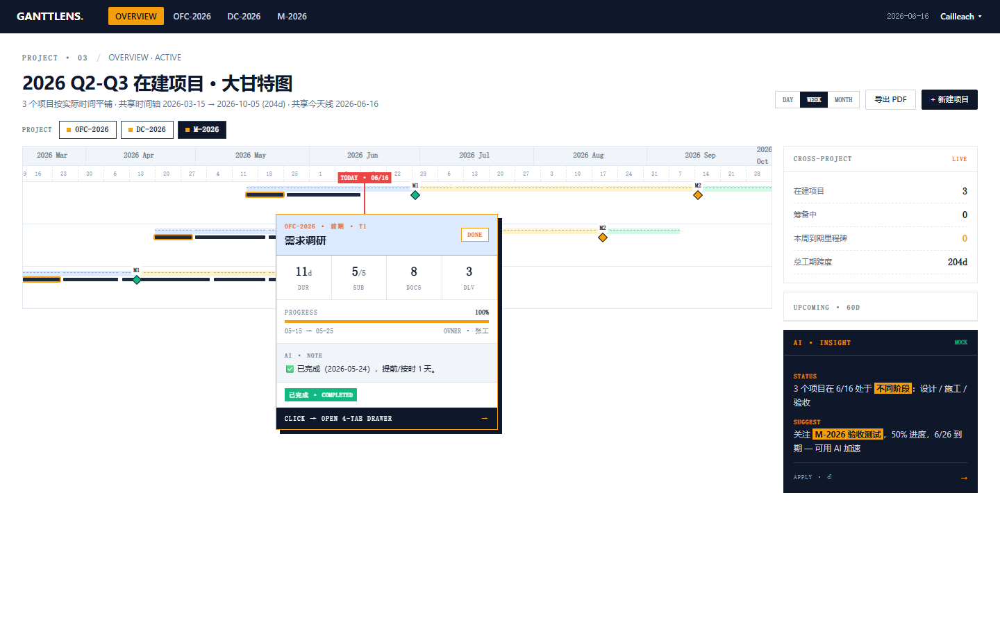
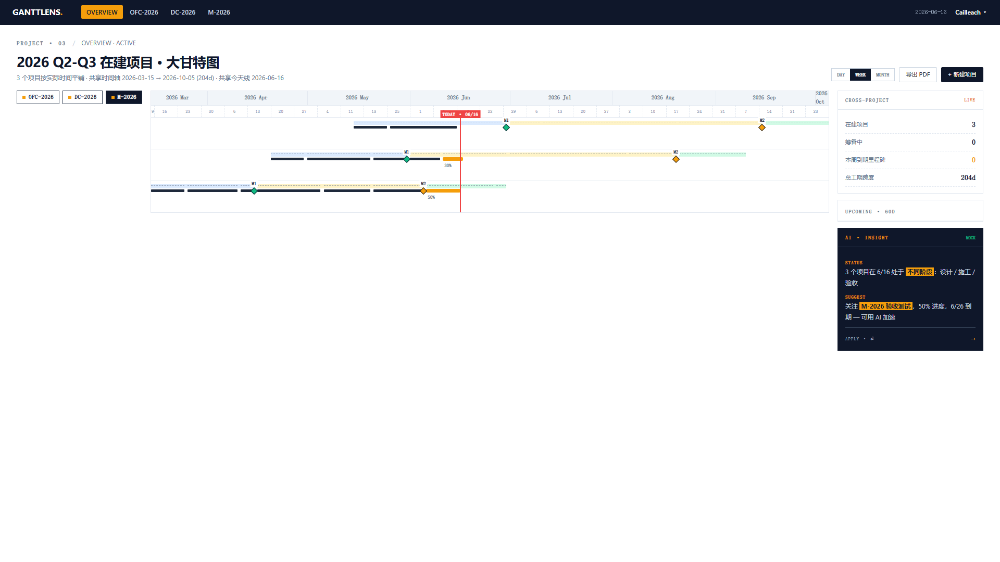
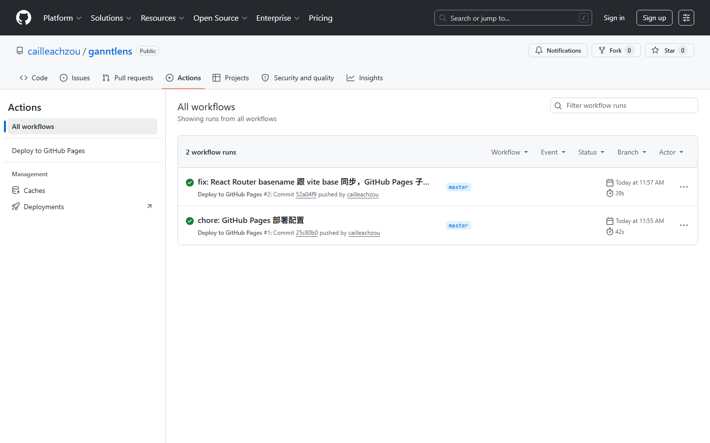

# GanttLens · TRAE 实践过程（按主题回忆 4 天开发）

> **作者**：Cailleach（邹景焘）· 弱电智能化设计师（非程序员）
> **配套主帖**：[GanttLens Demo · 简介 + 创作思路（论坛）](#)
> **工具**：TRAE IDE
> **在线 Demo**：https://cailleachzou.github.io/ganntlens/
> **Session 来源**（4 天 5 个关键 Session）：
> - D1-D2 大甘特图 + 共享时间轴：`...6a310e930aa837c4de6b76c4`（2026/6/16 16:51）
> - D3 节点下钻 4-Tab 抽屉：`...6a3109d70aa837c4de6b7592`（2026/6/16 16:31）
> - D4 Hover v9 + 抽屉 v9：`...6a3253ec244476575c84e58a`（2026/6/17 15:59）
> - D4 chips 推翻 + M1/M2 阶段边界：`...6a335f4fbdc087dbd2f48ccd`（2026/6/18 11:00）
> - D4 GitHub Pages 部署：`...6a336a77bdc087dbd2f48ebe`（2026/6/18 11:48）

---

## 前置说明

我是弱电智能化设计师，不写代码。CSS 是啥、git 怎么 push、Vite 是什么——我原来都只知道个名字。这次做 GanttLens，从头到尾是 Vibe Coding：把脑子里的需求告诉 TRAE，让它写，我提"这不对、那不行"。

**这篇按主题回忆，不按 Day 排**——因为每个主题里有完整的"问题 → 翻车 → 重做"故事，按 Day 切会把故事切散。

**配图说明**：主题 1 / 3 / 5 / 6 的 4 张图是论坛初赛投稿（[topic/31530](https://forum.trae.cn/t/topic/31530)）原图，作为本作品开发过程的"证明图片"；主题 2（4-Tab 抽屉）和主题 4（chips 推翻）的图是开发过程中本地留底。

---

## 主题 1：大甘特图 + 共享时间轴（D1-D2）



最早上手时我画了 3 张草图、3 种排布方式。最后选"**所有项目共享一根时间轴**"——因为项目最关心的是"跨项目比工期"，不是"单项目看阶段"。

D1 搭脚手架（Vite + React + TS + Zustand，这几个词我也是边写边学），D2 写完 3 个脱敏项目（OFC-2026 / DC-2026 / M-2026），跑出第一张大甘特图。

**那天最大的坑**：`dateToPercent` 函数算天数时少了一个 `Math.round`——5 月 15 日在 timeline 上偏了半格，盯着屏幕看半小时才发现是浮点误差。

**这种"非程序员会栽的跟头"，是这次最有意思的部分**：我不懂 `Math.round` 为什么必要，但 5 月 15 偏半格我能看出来。

---

## 主题 2：节点下钻 4-Tab 抽屉（D3）



D3 做的，也是我最想要的功能。

不是模态框、不是新页面、就是侧滑抽屉 + 4 个 Tab（详情 / 文件 / 活动 / AI 建议）。原因：实际工作里我打开详情**不是要跳走**，是要"瞄一眼继续干"。抽屉刚好不抢主图。

**细节调整**：一开始我选了 380px 宽，TRAE 说"再窄点给主图留呼吸"，我调成 320px 立刻好很多。这种"AI 帮你做减法"的瞬间挺爽——它不会替我决定，但会指出我没看到的余地。

---

## 主题 3：Hover 预览卡 v8 → v9 —— 一次教科书般的"返工"（D4）



D4 翻车了。原计划写完 hover 卡就收工，用 Playwright 验证发现：

- 鼠标快速划过任务条时 hover 卡疯狂闪（**防误触缺失**）
- 卡片超出右边界时被截掉一半（**边界处理缺失**）
- 任务条点击后 hover 卡不消失（**生命周期缺失**）

我直接说"这版不行，重做"。TRAE 给的 v9 方案我挺满意：

1. 鼠标进入延迟 250ms、离开 100ms（用 `setTimeout` 取消）
2. 卡片靠右时 `flip` 镜像显示
3. 抽屉打开时 `hoverSuppressed=true` 立即隐藏
4. `useRef` 跟踪 150ms 点击抗误触

最后 `verify-day4.py` 7/7 通过。

**这次返工最爽的地方**：我不懂这些 250ms / 100ms / 150ms 是怎么算出来的，但我能看出来"翻车了"。**非程序员的核心能力不是写代码，是定义"翻车了"。**

---

## 主题 4：推翻三栏布局 —— 一次"Vibe Coding 价值观"现身（D4）



D4 收尾时我做了一版"左侧 3 个项目 chips + 中间大甘特图 + 右侧跨项目面板"的三栏布局。TRAE 还加了"hover 上去联动右侧"的特效。

我自己看了页面 5 分钟，**直接推翻**：

> "既然实际交互在顶上，就不要左侧的 projects，这些框其实没用。"
> "把整个甘特图长度拉长到左边。"

这次推翻让甘特图从 1303px 直接拉到 1560px，**timeline 跟 gantt zone 也终于对齐了**（之前 chips 占的 290px 让 GanttChart 整体偏移，timeline 起点看着像在 5 月 22 日，其实 M-2026 是 3 月 15 日开始的）。

**我后来想明白一件事**：Vibe Coding 最值的地方不是"AI 干得快"，是"推翻 AI 干得动"——我敢说"这版不行"的前提，是重写成本几乎为零。

---

## 主题 5：M1/M2 节点位置修复 —— 阶段交界处不是项目起讫（D4）


里程碑位置一开始是"项目开始 / 项目结束"，我自己看了 3 秒就发现不对：

> "M1 和 M2 的节点位置有问题，应该在设计-施工-交付 两条线的中间位置，不是在最前或末端。"

M1（设计→施工）菱形应该在设计阶段的最后一天，M2（施工→验收）应该在施工阶段的最后一天。我把 6 个 milestone 的 date 全部改成 `design.planEnd` 和 `construction.planEnd`：

```ts
// OFC-2026
{ id: 'm1', date: '2026-06-30', betweenPhases: ['design', 'construction'] },
{ id: 'm2', date: '2026-09-15', betweenPhases: ['construction', 'acceptance'] },
```

DC-2026 改的时候出了 race condition：3 个 Edit 并行，DC-2026 那次没生效。我又串行重跑了一次才改对。

**教训**：批量改同类数据时串行更稳，或用 `replace_all`。

---

## 主题 6：GitHub Pages 部署 —— 5 个配置坑（D4）



最后一步是让评审点得开。我用 `gh repo create` 建了 `cailleachzou/ganntlens` 公仓，配 GitHub Pages 部署。踩了 5 个坑：

1. **vite base 路径**：`base: '/ganntlens/'`——不然资源 404
2. **React Router basename**：`BrowserRouter basename={...}`——不然站内链接跳到 `cailleachzou.github.io/` 根目录
3. **SPA 404 fallback**：GitHub Pages 不支持 SPA 自动 fallback，我加了个 `cp dist/index.html dist/404.html` 的步骤
4. **import.meta.env 类型**：tsconfig 没装 vite/client 类型，typecheck 红了一屏，加 `/// <reference types="vite/client" />` 修好
5. **首次部署没跑**：push 代码后 Pages 没自动跑 workflow，得手动 `gh api -X POST /repos/.../pages -f build_type=workflow` 启用

把项目根提到仓库根时，deploy.yml 的 `working-directory` 和 `cache-dependency-path` 一定要同步改——这个我栽过一次（修复 commit `11041f5`）。

现在 push 就自动部署，时间轴 1.4px 像素都对齐了。

---

## 一句话反思

Vibe Coding 的核心收益不是"AI 干得快"，是"推翻 AI 干得动"。

我作为非程序员，能在 4 天内从 0 到 GitHub Pages 上线——**不是因为我会写代码，是因为我敢说"这版不行，重做"，而且重做的成本是几分钟**。

---

## Session ID 凭据

| Day | 主题 | 开始时间 |
|---|---|---|
| D1-D2 | 大甘特图 + 共享时间轴 | 2026/6/16 16:51 |
| D3 | 节点下钻 4-Tab 抽屉 | 2026/6/16 16:31 |
| D4 | Hover v9 + 抽屉 v9 | 2026/6/17 15:59 |
| D4 | chips 推翻 + M1/M2 阶段边界 | 2026/6/18 11:00 |
| D4 | GitHub Pages 部署 | 2026/6/18 11:48 |

完整 Session ID（用于在 TRAE 平台检索 / 验证开发过程）：

```
3928979018359690:a0f4ae9c578a4ac38a8e8e2942754e46_6a3107250aa837c4de6b74d2.6a310e930aa837c4de6b76c6.6a310e930aa837c4de6b76c4:TRAE Work CN.0.1.19.no_sid.no_ppe.T(2026/6/16 16:51:31)
3928979018359690:2ee16ab9c6bd4a0910b728955f9cbd99_6a3107250aa837c4de6b74d2.6a3109d70aa837c4de6b7594.6a3109d70aa837c4de6b7592:TRAE Work CN.0.1.19.no_sid.no_ppe.T(2026/6/16 16:31:19)
3928979018359690:e8b463a795a9180b4981ce865712aa43_6a325035244476575c84e522.6a3253ec244476575c84e58c.6a3253ec244476575c84e58a:TRAE Work CN.0.1.19.no_sid.no_ppe.T(2026/6/17 15:59:40)
3928979018359690:378a67725405ff904ec0b6d025773104_6a325035244476575c84e522.6a335f4fbdc087dbd2f48ccf.6a335f4fbdc087dbd2f48ccd:TRAE Work CN.0.1.19.no_sid.no_ppe.T(2026/6/18 11:00:31)
3928979018359690:56d6f6b2026b5b40518bc72ea5a7fc7b_6a325035244476575c84e522.6a336a77bdc087dbd2f48ec0.6a336a77bdc087dbd2f48ebe:TRAE Work CN.0.1.19.no_sid.no_ppe.T(2026/6/18 11:48:07)
```

---

**作者**：Cailleach（邹景焘）· 弱电智能化设计师
**工具**：TRAE IDE
**回到主帖**：[GanttLens Demo · 简介 + 创作思路（论坛）](#)
